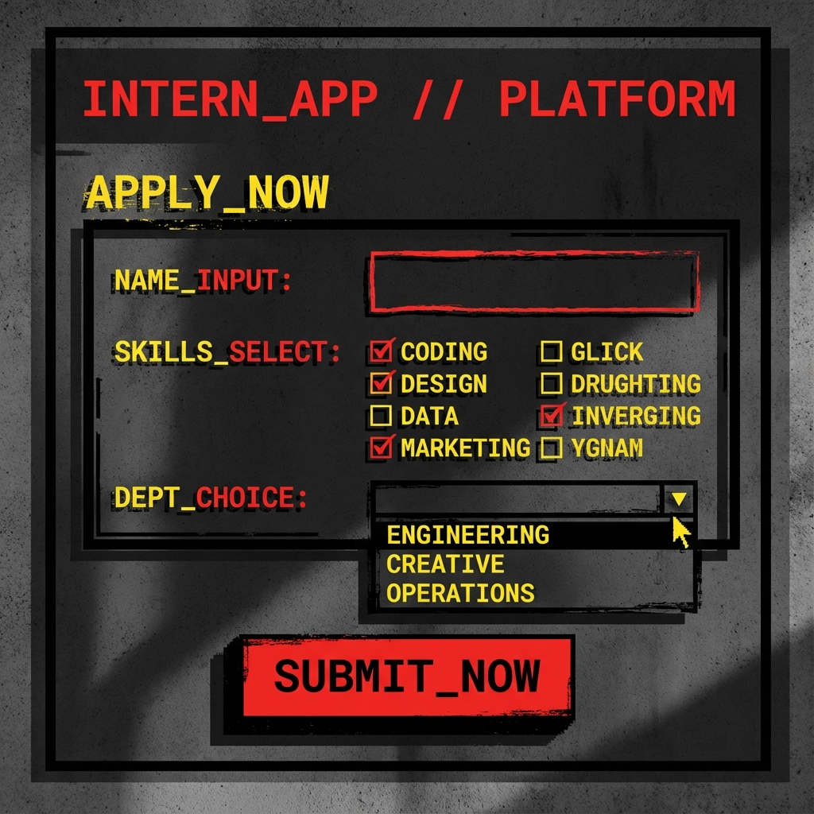

<div align="center">
  
  
  # 🔥 INTERN_HUNTER
  
  **A brutalist-style internship application portal that hits different**
  
  [](https://react.dev)
  [](https://tailwindcss.com)
  [](https://nodejs.org)
</div>

---

## 💀 What is this?

INTERN_HUNTER is a **no-nonsense, brutalist** internship application system built for the modern age. No corporate fluff. No boring forms. Just raw, edgy aesthetics that make applying for internships actually _fun_.

### ✨ Features

- 🎨 **Brutalist Design** - Thick borders, harsh shadows, bold colors
- 📝 **Multi-step Form** - Logistics → Skills → Review → SEND IT
- 📬 **Newsletter Signup** - "No spam fr fr"
- 📄 **CV Upload** - PDF/DOCX support
- 🗄️ **Database Storage** - SQLite/Turso for cloud deployment
- 🔒 **Secure** - No hardcoded secrets, proper .gitignore

---

## 🚀 Quick Start

### Prerequisites

- Node.js 18+
- npm

### Installation

```bash
# Clone the repo
git clone https://github.com/brianroyee/intern_hunter.git
cd intern_hunter

# Install dependencies
npm install

# Start the backend
npm start

# Start the frontend (in another terminal)
npx vite
```

Then open [http://localhost:5173](http://localhost:5173) 🎉

---

## 🛠️ Tech Stack

| Layer    | Technology                         |
| -------- | ---------------------------------- |
| Frontend | React 19, TypeScript, Tailwind CSS |
| Backend  | Express.js, Node.js                |
| Database | SQLite (local) / Turso (cloud)     |
| Styling  | Brutalist Design System            |

---

## 📁 Project Structure

```
intern_hunter/
├── App.tsx           # Main React application
├── server.js         # Express backend API
├── types.ts          # TypeScript interfaces
├── components/       # Reusable UI components
├── assets/           # Images and static files
├── uploads/          # CV file storage
└── applications.db   # SQLite database
```

---

## 🌐 Deployment

### Vercel + Turso (Recommended)

1. Create a [Turso](https://turso.tech) database
2. Add env vars to Vercel:
   - `TURSO_DATABASE_URL`
   - `TURSO_AUTH_TOKEN`
3. Deploy: `vercel`

---

## 📸 Screenshots

<div align="center">
  
</div>

---

## 👨‍💻 Author

**Brian Roy Mathew**

[](https://instagram.com/brianroymathew)
[](https://linkedin.com/in/brianroymathew)

---

<div align="center">
  <p>Built with 💀 and too much coffee</p>
  <p><sub>© 2024 INTERN_OS. ALL RIGHTS RESERVED.</sub></p>
</div>
